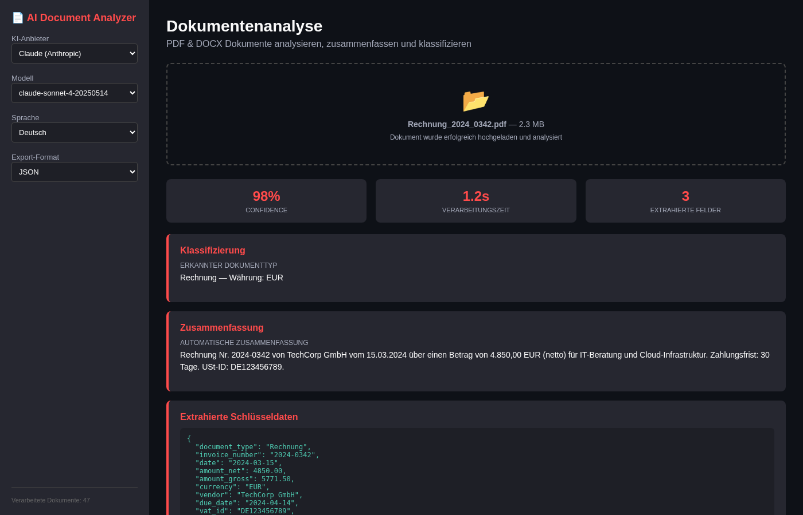

# AI Document Analyzer

[](https://python.org)
[](https://streamlit.io)
[](https://www.docker.com)
[](LICENSE)
[](https://anthropic.com)

> PDF & DOCX Dokumente automatisch analysieren, zusammenfassen und klassifizieren — mit Claude, Gemini oder Ollama.

Automatically analyze, summarize and classify PDF & DOCX documents — with Claude, Gemini or Ollama.

---

## Screenshot


*Upload-Bereich mit Live-Analyse: Klassifizierung, Zusammenfassung und Schlüsseldaten-Extraktion in Echtzeit.*

---

## Features

| Feature | Beschreibung |
|---------|-------------|
| PDF & DOCX Upload | Drag & Drop oder Dateiauswahl |
| KI-Zusammenfassung | Automatisch in max. 5 Sätzen (Deutsch/Englisch) |
| Dokumentklassifizierung | Rechnung, Vertrag, Angebot, Bericht, Sonstiges |
| Schlüsseldaten-Extraktion | Datum, Betrag, Parteien, Fristen als JSON |
| Multi-Provider | Claude, Gemini, Ollama (lokal) |
| Export | JSON & CSV |
| 100% lokal möglich | Mit Ollama keine Cloud-API nötig |

---

## Quick Start

```bash
# Lokal starten
git clone https://github.com/ceeceeceecee/ai-document-analyzer.git
cd ai-document-analyzer
pip install -r requirements.txt
cp .env.example .env      # API-Keys eintragen
streamlit run app.py

# Oder mit Docker
docker compose up -d
```

Dann: [http://localhost:8501](http://localhost:8501) öffnen.

### Voraussetzungen

- Python 3.11+
- Claude/Gemini API Key oder Ollama (lokal)
- (Optional) Docker für Container-Deployment

---

## Projektstruktur

```
ai-document-analyzer/
├── app.py                      # Streamlit Web-App
├── analyzer/
│   ├── document_processor.py   # PDF/DOCX Verarbeitung
│   └── ai_analyzer.py          # KI-Analyse (Claude/Gemini/Ollama)
├── prompts/
│   ├── summarize.txt           # System-Prompt: Zusammenfassung
│   ├── classify.txt            # System-Prompt: Klassifizierung
│   └── extract.txt             # System-Prompt: Schlüsseldaten
├── docker-compose.yml
├── requirements.txt
└── docs/
    └── setup-guide.md          # Detaillierte Einrichtung
```

---

## Use Cases

| Zielgruppe | Szenario |
|------------|----------|
| Buchhaltung | Rechnungen: Beträge, Daten, Referenznummern extrahieren |
| Rechtsabteilung | Verträge: Art erkennen, Fristen & Parteien identifizieren |
| Assistenz | Posteingang: E-Mail-Anhänge automatisch klassifizieren |
| IT / DevOps | Dokumentation: Technische Docs zusammenfassen |

---

## Tech Stack

- **Streamlit** — Web-Interface
- **Claude / Gemini / Ollama** — KI-Analyse
- **PyPDF2 / python-docx** — Dokument-Verarbeitung
- **Docker** — Container-Deployment

---

## Roadmap

- [ ] Batch-Verarbeitung (Ordner)
- [ ] OCR für gescannte Dokumente
- [ ] RAG: Fragen an Dokumente stellen
- [ ] Multi-Sprachen-Erkennung

---

## Contributing

1. Fork → Feature-Branch → Commit → Push → Pull Request

---

## Lizenz

[MIT](LICENSE) — frei nutzbar.

## Author

[ceeceeceecee](https://github.com/ceeceeceecee)

## Weitere Projekte

- [Self-Hosted AI Chatbot](https://github.com/ceeceeceecee/self-hosted-ai-chatbot) — DSGVO-konformer Chatbot
- [AI Market Analysis Bot](https://github.com/ceeceeceecee/ai-market-analysis-bot) — Marktanalyse
