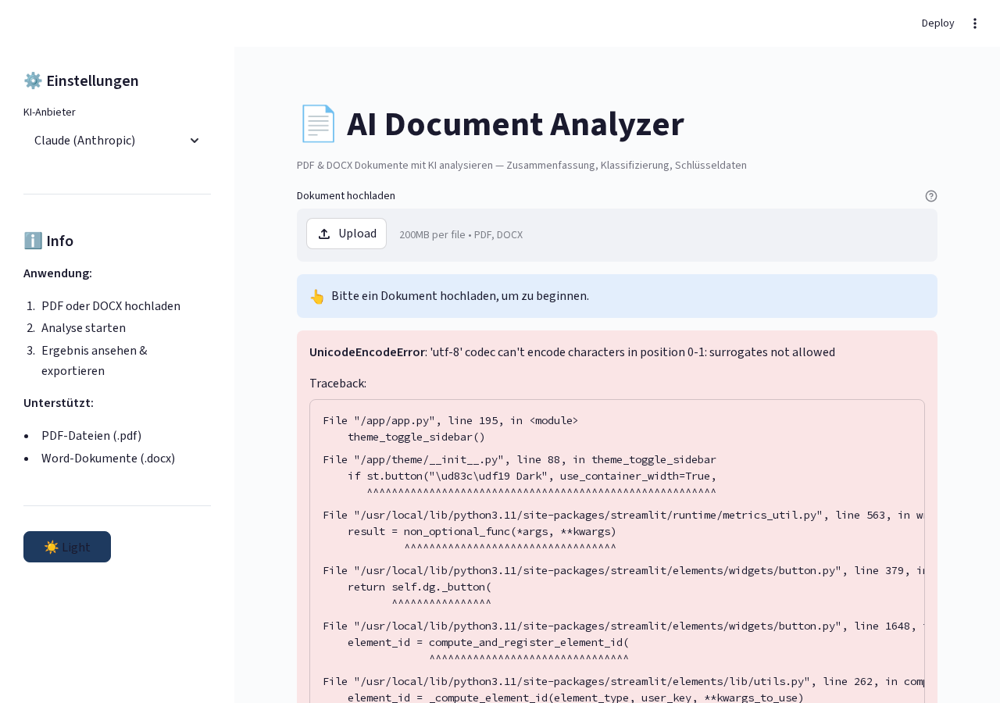

# Ai Document Analyzer

<p align="center">
</p>

    

> KI-gestützte Dokumentenanalyse für Behörden und Unternehmen

## Overview

Automatisiert die Analyse von PDFs und Dokumenten mit Claude AI. Extrahiert Schlüsselinformationen, klassifiziert Dokumente und generiert Zusammenfassungen — komplett DSGVO-konform und self-hosted.

## Features

- PDF- und Dokumentenanalyse mit Claude AI
- Automatische Klassifizierung und Kategorisierung
- Schlüsselinformation-Extraktion
- Zusammenfassungs-Generierung
- Batch-Verarbeitung
- DSGVO-konforme Datenverarbeitung

## Tech Stack

| Tech | Zweck |
|------|-------|
| Python 3.11+ | Backend & API |
| Streamlit | Web-Interface |
| Claude AI | Dokumentenanalyse |
| Docker | Deployment |

## Quick Start

```bash
pip install -r requirements.txt
streamlit run app.py
```

## Screenshots

**Streamlit Web-Interface mit Dokumenten-Upload und Analyse-Ergebnissen**



---

## Contributing

Beiträge sind willkommen! Bitte erstelle einen Issue oder Pull Request.

## License

MIT License — siehe [LICENSE](LICENSE).

<p align="center">
</p>